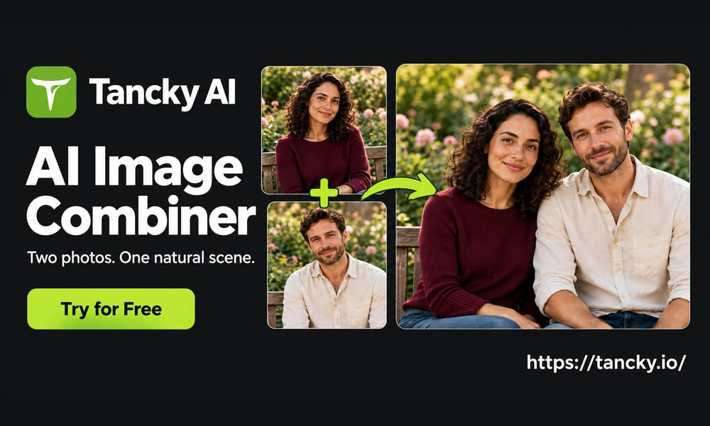
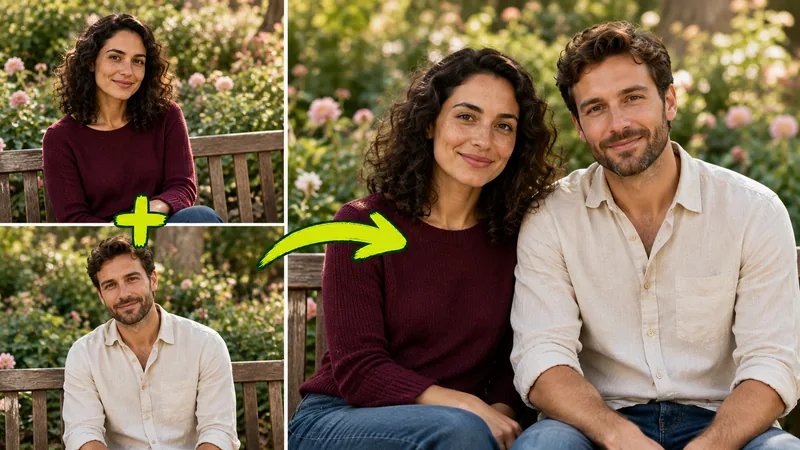
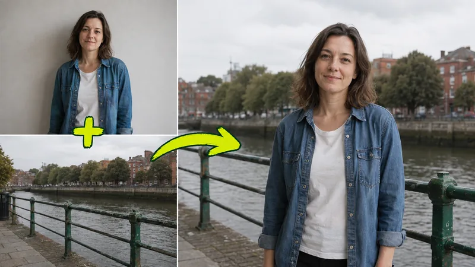
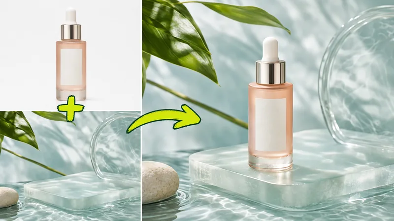
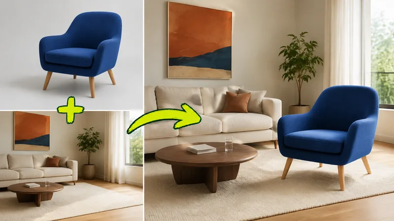
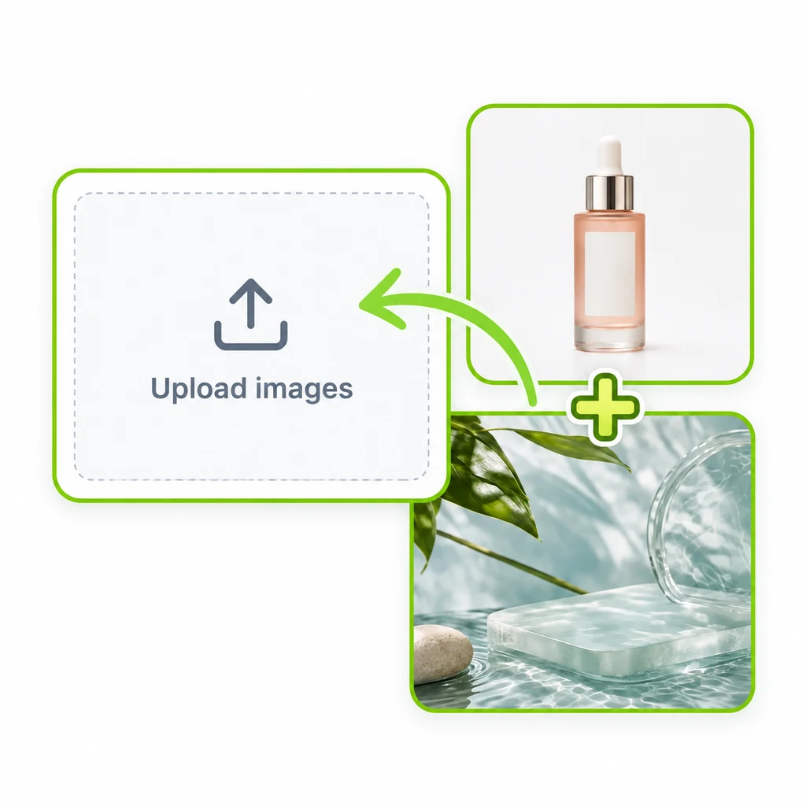
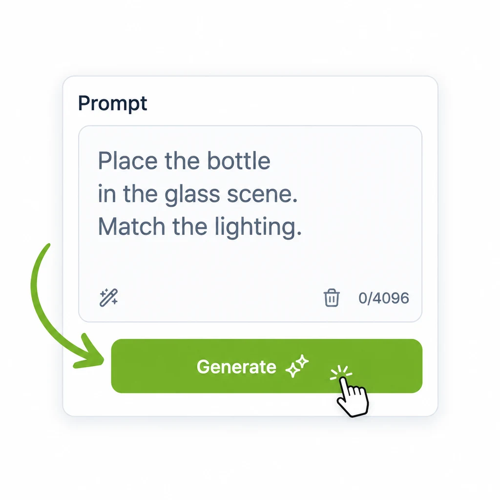
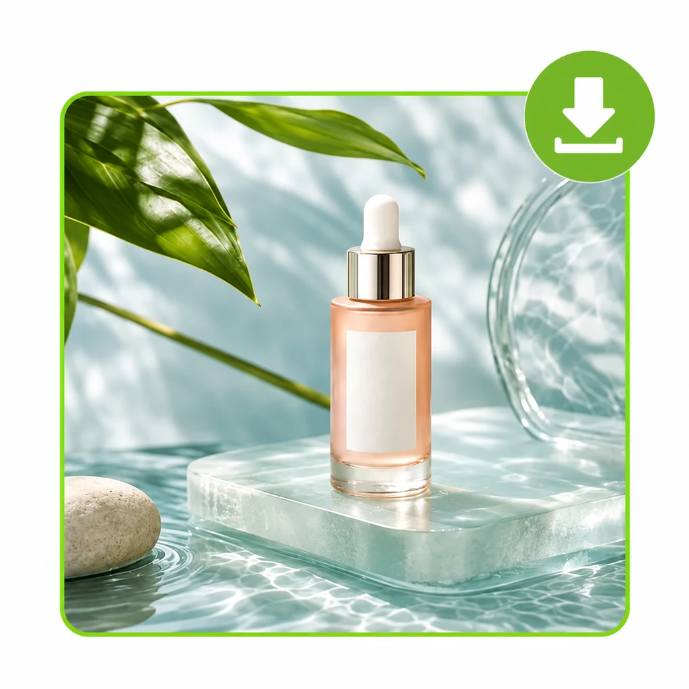

# AI Image Combiner

  

**[Tancky AI](https://tancky.io)** is a free online **AI image combiner** that merges two or more pictures into one natural, photorealistic scene. Upload your photos, describe the composition, and the AI image combiner matches lighting, perspective and shadows for you. No Photoshop, no manual masking.

👉 **Try the AI image combiner free: [https://tancky.io](https://tancky.io)**

## What is an AI image combiner?

An AI image combiner is a photo merger that brings multiple pictures into one cohesive composition. A traditional collage places photos side by side in bordered frames, leaving visible seams and mismatched lighting. An AI image combiner analyzes the subjects, depth and ambient light across every reference image, then renders a single new photograph in which every element looks like it was captured in the same shot.

## What can you create with an AI image combiner?

### Combine people from separate photos into one natural shot

Bring distant family members, friends or partners together in a single portrait. The AI image combiner preserves recognizable facial features, hair textures and expressions while harmonizing scale, eye levels and skin tone illumination.

  

### Blend a portrait with a scenic background

Pair an everyday headshot with a travel destination or studio setting. Depth of field, horizon lines and sunlight angles are matched so the subject sits naturally inside the scene.

  

### Stage products for e-commerce

Place a product cutout into a styled lifestyle scene. Packaging shapes, brand typography and logos stay sharp, with contact shadows and reflections added automatically.

  

### Preview furniture before buying

Insert a furniture reference into a photo of your room. The room's flooring, walls and decor are preserved, and the new piece is rendered at a realistic scale.

  

## How to use the AI image combiner

| Step 1: Upload | Step 2: Describe | Step 3: Generate |
| :---: | :---: | :---: |
|  |  |  |
| Upload 2 to 4 pictures in JPG, PNG or WebP format. Clear, well lit photos work best. | Describe how the subjects should be positioned, lit and framed. | Pick an aspect ratio, click Generate, then review and download the result. |

## Why choose this AI image combiner

- **Photorealistic light and perspective fusion.** Contrasting light sources, color temperatures and camera angles are harmonized, with cast shadows and reflections synthesized automatically.
- **Facial fidelity and product detail preservation.** Faces, hair textures and brand labels are retained with high fidelity.
- **Zero manual masking.** No pen tools, clipping paths or feathering. Subjects are extracted and composited for you.
- **High-resolution output with commercial rights.** Use the results in ads, e-commerce listings, client pitches and social media.
- **Free to start.** New users receive trial credits on signup. Credit packs never expire.

## Tips for better results

- Start with sharp, high-resolution source images where the subject is in clear focus.
- Pair photos with compatible camera angles, such as an eye-level portrait with an eye-level background.
- State in the prompt which image supplies the background and where each subject should be placed.
- Mention details that must stay unchanged, such as a logo, an outfit or a piece of furniture.

## FAQ

**How is an AI image combiner different from a photo collage?**
A collage arranges pictures side by side in a grid. An AI image combiner blends the subjects into one scene with unified depth, perspective and lighting.

**Can I combine multiple images into one photo?**
Yes. You can combine up to 4 source pictures at once.

**Does the AI image combiner preserve faces and logos?**
Yes. Facial features, expressions and hair are preserved in portraits, and packaging shapes, typography and logos stay clear for products.

**Can I use the AI image combiner for free?**
Yes. Every new user gets trial credits on signup, with optional credit packs and subscriptions afterwards.

**Can I use the generated images commercially?**
Yes. Finished composites include commercial rights.

## More AI photo tools

- [AI Couple Photo Maker](https://tancky.io/ai-couple-photo-maker)
- [AI Family Photo Generator](https://tancky.io/ai-family-photo-generator)
- [AI Wedding Photo Generator](https://tancky.io/ai-wedding-photo-generator)
- [AI Background Remover](https://tancky.io/background-remover)

## Links

- AI Image Combiner: [https://tancky.io](https://tancky.io)
- Guide: [How to combine two images with AI](https://tancky.io/blog/how-to-combine-two-images-with-ai)
- Pricing: [https://tancky.io/pricing](https://tancky.io/pricing)
- Updates: [https://tancky.io/updates](https://tancky.io/updates)
